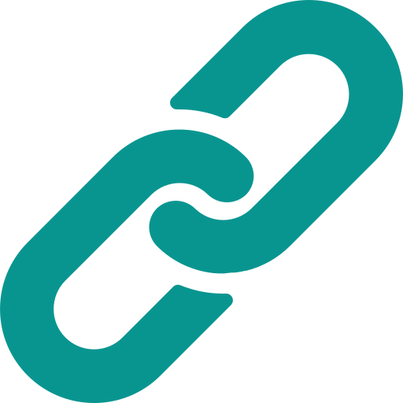

<a name="readme-top"></a>

[![Contributors][contributors-shield]][contributors-url]
[![Forks][forks-shield]][forks-url]
[![Stargazers][stars-shield]][stars-url]
[![Issues][issues-shield]][issues-url]
[![MIT License][license-shield]][license-url]
[![LinkedIn][linkedin-shield]][linkedin-url]

<!-- PROJECT LOGO -->
<br />
<div align="center">
  <a href="https://github.com/ASJordi/urlshortener">
    
  </a>

  <h3 align="center">URL Shortener</h3>

  <p align="center">
    URL shortener using HTML, CSS, JavaScript, NodeJS, Express and MongoDB. 
    <br />
    <a href="https://github.com/ASJordi/urlshortener"><strong>Explore the docs »</strong></a>
    <br />
    <br />
    <a href="https://link-shortly.netlify.app/">View Demo</a>
    ·
    <a href="https://github.com/ASJordi/urlshortener/issues">Report Bug</a>
    ·
    <a href="https://github.com/ASJordi/urlshortener/issues">Request Feature</a>
  </p>
</div>

<!-- TABLE OF CONTENTS -->
<details>
  <summary>Table of Contents</summary>
  <ol>
    <li>
      <a href="#about-the-project">About The Project</a>
      <ul>
        <li><a href="#built-with">Built With</a></li>
      </ul>
    </li>
    <li>
      <a href="#getting-started">Getting Started</a>
      <ul>
        <li><a href="#prerequisites">Prerequisites</a></li>
        <li><a href="#installation">Installation</a></li>
      </ul>
    </li>
    <li><a href="#usage">Usage</a></li>
    <li><a href="#contributing">Contributing</a></li>
    <li><a href="#license">License</a></li>
    <li><a href="#contact">Contact</a></li>
  </ol>
</details>

<!-- ABOUT THE PROJECT -->
## About The Project

[![Product Name Screen Shot][product-screenshot]](https://link-shortly.netlify.app/)

URL shortener using HTML, CSS and JavaScript for the entire frontend. As well as, NodeJS, MongoDB and Express for the entire server-side. To see the frontend code go to `/client`, and for the backend go to `/server`.
The frontend of the application was deployed on Netlify. The backend of the application was deployed on Railway.

### Built With

* HTML5
* CSS
* JavaScript
* NodeJS
* Express
* MongoDB

<!-- GETTING STARTED -->
## Getting Started

To get a local copy up and running follow these simple example steps.

### Prerequisites

List of prerequisites to use the application correctly.
* [NodeJS](https://nodejs.org/en/download)
* To check if NPM is installed, run the following command in your terminal:
  ```sh
  npm -v
  ```
* [MongoDB](https://www.mongodb.com/try/download/community) or [MongoDB Atlas](https://www.mongodb.com/cloud/atlas)

### Installation

_This section describes the application installation and configuration process for the frontend and backend._

1. Create a database in MongoDB Atlas or MongoDB locally.
2. Get the string connection of the database.
3. Clone the repository
   ```sh
   git clone https://github.com/ASJordi/urlshortener.git
   ```
4. Install NPM packages
   ```sh
   npm install
   ```
5. Configure the environment variables in server folder
   ```JS
   // .env file
   MONGODB_URI = <your_mongodb_uri>
   ENV = <your_environment>
   URL = <your_url>
   ``` 
6. Set your API URL in the frontend
   ```JS
   // client\public\index.js
   const API_URL = <your_api_url>
   ```
7. Set the whiteList in the backend
   ```JS
   // server\server.js
   const whiteList = [<your_whitelist>]
   ```
8. Run the server
   ```sh
   npm run dev
   ```
9.  Run the frontend (with VSCode Live Server)

<!-- USAGE EXAMPLES -->
## Usage
The operation of the application is very simple. First paste the URL of the destination, then click on the scissors button. This returns the shortened link as a result. To copy the link click on the copy button, or click directly on the link. The link will be copied to the clipboard.

<!-- CONTRIBUTING -->
## Contributing

Contributions are what make the open source community such an amazing place to learn, inspire, and create. Any contributions you make are **greatly appreciated**.

If you have a suggestion that would make this better, please fork the repo and create a pull request. You can also simply open an issue with the tag "enhancement".
Don't forget to give the project a star! Thanks again!

1. Fork the Project
2. Create your Feature Branch (`git checkout -b feature/AmazingFeature`)
3. Commit your Changes (`git commit -m 'Add some AmazingFeature'`)
4. Push to the Branch (`git push origin feature/AmazingFeature`)
5. Open a Pull Request

<!-- LICENSE -->
## License

Distributed under the MIT License. See `LICENSE.txt` for more information.

<!-- CONTACT -->
## Contact

Jordi Ayala - [@ASJordi](https://twitter.com/ASJordi)

Project Link: [https://github.com/ASJordi/urlshortener](https://github.com/ASJordi/urlshortener)

[contributors-shield]: https://img.shields.io/github/contributors/ASJordi/urlshortener.svg?style=for-the-badge
[contributors-url]: https://github.com/ASJordi/urlshortener/graphs/contributors
[forks-shield]: https://img.shields.io/github/forks/ASJordi/urlshortener.svg?style=for-the-badge
[forks-url]: https://github.com/ASJordi/urlshortener/network/members
[stars-shield]: https://img.shields.io/github/stars/ASJordi/urlshortener.svg?style=for-the-badge
[stars-url]: https://github.com/ASJordi/urlshortener/stargazers
[issues-shield]: https://img.shields.io/github/issues/ASJordi/urlshortener.svg?style=for-the-badge
[issues-url]: https://github.com/ASJordi/urlshortener/issues
[license-shield]: https://img.shields.io/github/license/ASJordi/urlshortener.svg?style=for-the-badge
[license-url]: https://github.com/ASJordi/urlshortener/blob/master/LICENSE.txt
[linkedin-shield]: https://img.shields.io/badge/-LinkedIn-black.svg?style=for-the-badge&logo=linkedin&colorB=555
[linkedin-url]: https://linkedin.com/in/ASJordi
[product-screenshot]: client/public/images/screenshot.png